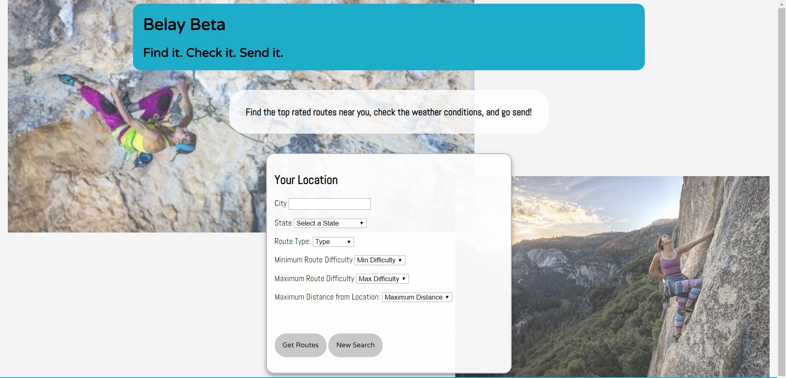
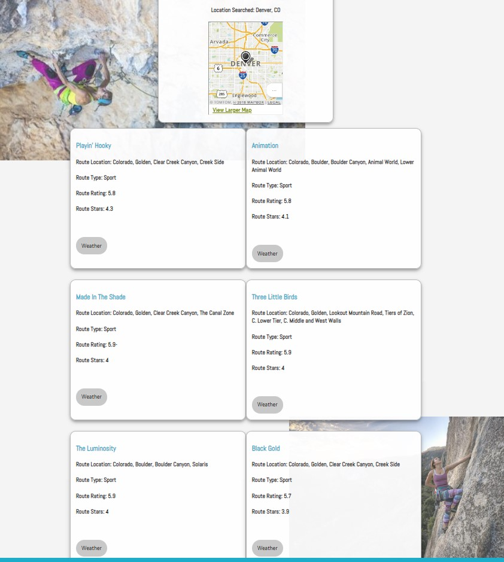
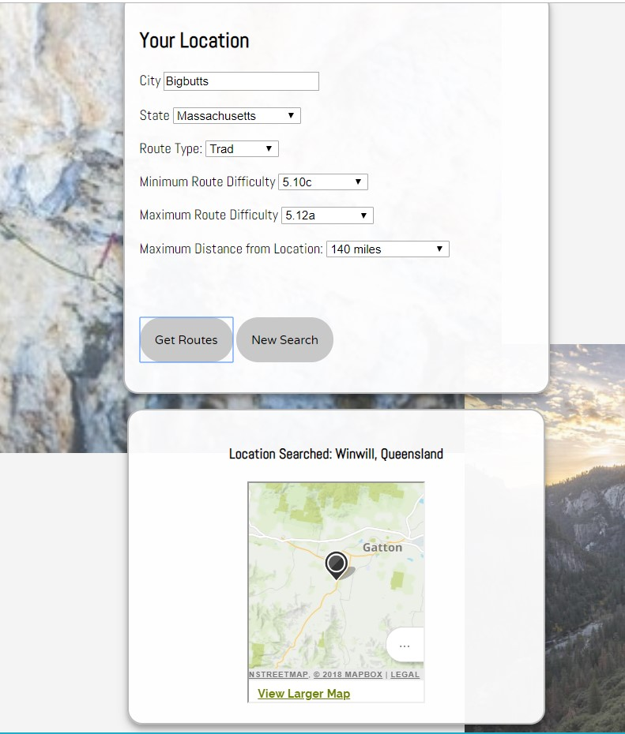
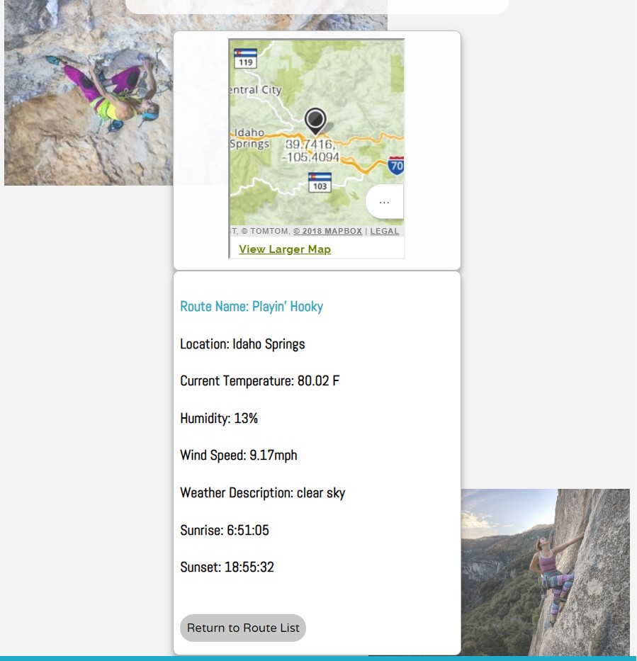

# Belay Beta #

## Table of Contents ##
  -[Summary](#Summary)
  -[Background Information](#Background)
  -[API Information](#APIs)
  -[Technology](#Technology)

## Summary ##

This is an application for finding the top ten rated routes climbing routes closest to a given user location, within the parameters of difficulty and
climbing type (i.e. trad, sport, toprope) input by the user. 

This app uses the Mountain Project, Open Weather Map, and Mapquest APIs. 

## Background ##

Climbing terms used in this application:

### Rating ###
Difficulty rating is set via class 5 of the [Yosemite Decimal System](https://en.wikipedia.org/wiki/Yosemite_Decimal_System), which ranges from 5.0 to 5.15d, used to define progressively more difficult moves. 

### Climbing Types ###
[Trad](https://en.wikipedia.org/wiki/Traditional_climbing)- Traditional climbing. A form of climbing where the climb is a style of rock climbing in which a climber or group of climbers place all gear required to protect against falls, and remove it when a pitch is complete.

[Sport](https://en.wikipedia.org/wiki/Sport_climbing)- Sport climbing. A form of rock climbing that relies on permanent anchors fixed to the rock for protection. This is in contrast to traditional climbing where climbers must place removable protection as they climb.

[Toprope](https://en.wikipedia.org/wiki/Top_rope_climbing)- Top-roping. A style in climbing in which the climber is securely attached to a rope which then passes up, through an anchor system at the top of the climb, and down to a belayer at the foot of the climb.

## APIs ##

### API Calls ###

This app make 4 separate API calls. 

The first is to Mapquest to use their geocoding API to covert the City and State input from the user into latitude and longitude coordinates. Please note that the geocoder does some of it's own autocorrectly and will try to find a location similar to whatever is input, even if the input is 
not an actual location (i.e. try inputting "Bigbutts, MA" as a location). 

The second API call is back to Mapquest. Because of the autocorrecting nature of the first API call, it is important for the user to know which location was actually searched, as a simple typo may lead to a completely different search than expected. To help the user ensure they are searching the correct location, a feature
displaying the searched location and map was added to the UI after a search is completed and above the list of routes. The coordinates from the location returned by the first API call to Mapquest are then sent back to Mapquest through its reverse geocoder, converting the latitude and longitude into a city and state location.
This then becomes the city/state location displayed as the "location searched" feature.  

The third API call is to the Mountain Project API, which will return a list of 100 routes within the difficulty range and maximum distance input by the user. The application then filters this list of 100 by climbing type input by the user, and returns the top ten rated routes, as rated by "STARS" on 
Mountain Project.

The fourth and final API call is to Open Weather Map, which uses the latitude and longitude coordinates for the route (returned in the Mountain Project results) and pulls up the current weather conditions for the route location including tempature, humidity, windspeed, and overall conditions, as well as sunrise
and sunset times. 

### API Keys ###

This application requires the host to register for three API keys: Mapquest, Mountain Project, and Open Weather Map. You can visit the links below to register for your own keys. 

Mapquest: https://developer.mapquest.com/documentation/geocoding-api/

Mountain Project: https://www.mountainproject.com/data

OpenWeather: https://openweathermap.org/api 

Once you have registered and obtained your keys, you will need to create a separate javascript file that contains your API keys in an object named "config"
example:
var config = {
	mapQuestKey: 'APIKEY',
	mountainProjectKey: 'APIKEY',
	openWeatherKey: 'APIKEY,
}

Once you plug your own values in and link your file (my file keys.js is linked in line 196 of index.html), the application should pull data and run normally.

## Technology ##

This app was written using HTML, CSS, JavaScript, and JQuery. 

